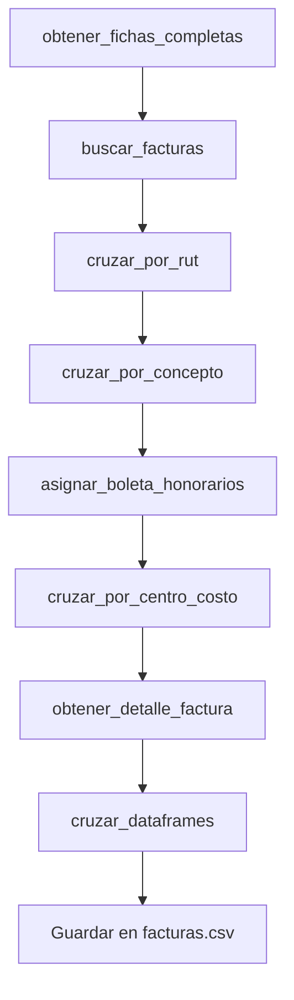
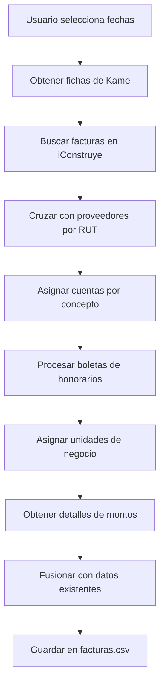
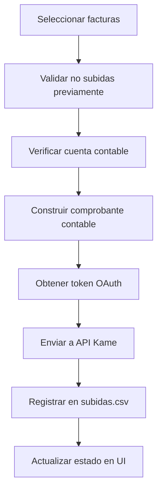
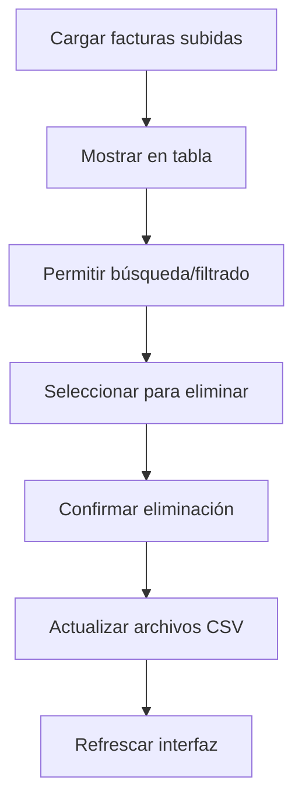

# Documentación del Módulo de Facturación

## Visión General

El módulo de Facturación es un sistema integral para la gestión automatizada de facturas en una constructora. Integra APIs externas (iConstruye y Kame), procesa datos contables, y permite el envío automatizado de comprobantes contables. El sistema maneja todo el flujo desde la consulta de facturas hasta su procesamiento final en el sistema contable.

## Arquitectura del Sistema

### Estructura de Archivos
```
/facturacion/
├── funciones.py                 # Lógica principal del módulo
├── templates/
│   ├── facturas.html           # Interfaz principal de gestión de facturas
│   ├── facturas_subidas.html   # Gestión de facturas procesadas
│   └── preparar_facturas.html  # Interfaz para actualización de datos
├── facturas.csv                # Base de datos principal de facturas
├── facturas - copia.csv        # Respaldo de facturas
└── main.py                     # Endpoints FastAPI
```

### Directorio Persistente
El sistema utiliza un directorio persistente (`/opt/render/project/data`) para almacenar:
- `facturas.csv` - Base de datos principal de facturas
- `subidas.csv` - Registro de facturas enviadas a Kame
- `facturas_subidas_datos.csv` - Datos completos de facturas procesadas
- `cuentas.xlsx` - Configuración de cuentas contables
- `UN.xlsx` - Configuración de unidades de negocio

## APIs y Integraciones

### 1. API iConstruye
**Base URL:** `https://api.iconstruye.com/cvbf/api/`
**Autenticación:** Clave API (`ICONSTRUYE_API_KEY`)

#### Endpoints Utilizados:
- `/Factura/Buscar` - Búsqueda de facturas por criterios
- `/Factura/PorId` - Obtener detalles de factura específica

### 2. API Kame
**Base URL:** `https://api.kameone.cl/api/`
**Autenticación:** OAuth 2.0 Client Credentials

#### Endpoints Utilizados:
- `/oauth/token` - Obtención de token de acceso
- `/Maestro/getListFicha` - Datos de fichas/proveedores
- `/Maestro/getListUnidadNegocio` - Unidades de negocio
- `/Contabilidad/addComprobante` - Envío de comprobantes contables

## Componentes Principales

### 1. Búsqueda y Obtención de Facturas

#### `buscar_facturas()`
**Ubicación:** `funciones.py:92-176`

Consulta facturas desde la API de iConstruye con múltiples criterios de filtrado.

**Parámetros principales:**
- `IdOrgc`: ID de organización (-1 para todas)
- `FechaEmisDesde/FechaEmisHasta`: Rango de fechas
- Filtros opcionales: RazonSocialC, EstadoDocumento, EstadoPago, etc.

**Funcionalidad:**
```python
# Ejemplo de uso
facturas = buscar_facturas(
    IdOrgc=-1,
    FechaEmisDesde="2025-01-01",
    FechaEmisHasta="2025-01-31",
    EstadoDocumento="Aprobada"
)
```

**Proceso:**
1. Construye parámetros de consulta
2. Realiza petición HTTP GET con timeout de 30s
3. Procesa respuesta JSON
4. Retorna DataFrame de pandas con resultados

#### `obtener_detalle_factura()`
**Ubicación:** `funciones.py:327-369`

Obtiene información detallada de una factura específica.

**Retorna:**
```python
{
    "montoNeto": float,
    "montoNoAfectoOExento": float
}
```

### 2. Integración con Sistema Kame

#### `obtener_token()`
**Ubicación:** `funciones.py:182-199`

Obtiene token de acceso OAuth 2.0 para API de Kame.

**Credenciales requeridas:**
```python
KAME_CLIENT_ID = "client_id"
KAME_CLIENT_SECRET = "client_secret"
```

#### `obtener_fichas_completas()`
**Ubicación:** `funciones.py:202-234`

Descarga información completa de proveedores desde Kame con paginación automática.

**Características:**
- Paginación automática
- Manejo de errores robusto
- Retorna DataFrame completo

#### `subir_facturas_kame()`
**Ubicación:** `funciones.py:581-696`

Función principal para enviar comprobantes contables a Kame.

**Validaciones:**
1. Verifica si la factura ya fue subida
2. Valida existencia de cuenta contable
3. Construye payload del comprobante
4. Envía a API de Kame
5. Registra en archivos de control

**Estructura del comprobante:**
```python
payload = {
    "usuario": "jgutierrez@constructoraicc.cl",
    "tipoComprobante": "TRASPASO",
    "folio": "",
    "fecha": fecha,
    "comentario": comentario,
    "detalle": [
        {
            "cuenta": cuenta,
            "debe": monto,
            "haber": 0,
            "comentario": comentario,
            "rutFicha": rut,
            "documento": proveedor,
            "folioDocumento": folio,
            "unidadNegocio": unidad,
            # ... más campos
        }
    ]
}
```

### 3. Procesamiento y Cruce de Datos

#### `preparar_facturas()`
**Ubicación:** `funciones.py:559-579`

Función principal que orquesta todo el proceso de actualización de facturas.

**Flujo de procesamiento:**


#### `cruzar_por_rut()`
**Ubicación:** `funciones.py:244-264`

Cruza facturas con información de proveedores por RUT.

**Lógica:**
- Left join entre facturas y fichas
- Limpieza de puntos en RUTs
- Marca "Proveedor no encontrado" para sin match

#### `cruzar_por_concepto()`
**Ubicación:** `funciones.py:267-278`

Asigna cuentas contables basado en concepto de compras.

#### `cruzar_por_centro_costo()`
**Ubicación:** `funciones.py:292-310`

Asigna unidades de negocio basado en centro de costo.

#### `asignar_boleta_honorarios()`
**Ubicación:** `funciones.py:312-325`

Lógica especial para categorizar boletas de honorarios.

### 4. Gestión de Archivos y Persistencia

#### `agregar_a_subidas_csv()`
**Ubicación:** `funciones.py:16-89`

Gestiona el registro de facturas procesadas.

**Funciones:**
1. Evita duplicados en subidas.csv
2. Guarda datos completos en facturas_subidas_datos.csv
3. Crea archivos si no existen

#### `agregar_campo_subidas_a_facturas()`
**Ubicación:** `funciones.py:473-510`

Agrega campo "Subidas" al DataFrame de facturas para indicar estado.

#### `borrar_facturas_por_ids()`
**Ubicación:** `funciones.py:433-471`

Elimina facturas por ID de archivos CSV.

#### `cruzar_dataframes()`
**Ubicación:** `funciones.py:512-557`

Función avanzada para fusionar DataFrames manteniendo integridad.

**Características:**
- Agrega nuevos registros
- Actualiza registros existentes
- Mantiene datos no modificados
- Manejo de tipos de datos

## Endpoints API (main.py)

### Navegación y Vistas
- `GET /facturas` - Interfaz principal de gestión
- `GET /facturas-subidas` - Gestión de facturas procesadas
- `GET /preparar-facturas` - Interfaz de actualización

### API de Datos
- `GET /api/facturas` - Obtener lista de facturas con filtros
- `POST /api/subir-kame` - Enviar facturas seleccionadas a Kame
- `POST /api/facturas/borrar` - Eliminar facturas seleccionadas
- `POST /api/exportar-excel` - Exportar facturas filtradas
- `POST /api/preparar-facturas` - Actualizar datos de facturas

### API de Facturas Subidas
- `GET /api/facturas-subidas` - Listar facturas procesadas
- `POST /api/facturas-subidas/eliminar` - Eliminar del registro

## Interfaz de Usuario

### 1. Gestión Principal (facturas.html)

**Funcionalidades:**
- Tabla interactiva con facturas
- Filtros avanzados (tipo, fecha, estado, cuenta, etc.)
- Selección múltiple con checkboxes
- Códigos de color por estado:
  - 🟡 Pendiente (amarillo)
  - 🟢 Pagada (verde)
  - 🔴 Rechazada (rojo)
  - 🔴 Sin cuenta (rojo intenso)

**Acciones disponibles:**
- Exportar a Excel
- Enviar a Kame
- Borrar facturas
- Filtrado en tiempo real

### 2. Facturas Subidas (facturas_subidas.html)

**Funcionalidades:**
- Visualización de facturas procesadas
- Búsqueda por folio, RUT o proveedor
- Eliminación de registros procesados
- Información detallada (ID, folio, RUT, proveedor, fecha, monto)

### 3. Preparar Facturas (preparar_facturas.html)

**Funcionalidades:**
- Selección de rango de fechas
- Barra de progreso animada
- Feedback visual del proceso
- Manejo de errores con mensajes claros

## Estructura de Datos

### Campos de Facturas (facturas.csv)
```python
campos_principales = {
    'idDocumento': 'ID único interno',
    'folioUnico': 'Folio único de factura',
    'tipoFactura': 'Tipo de documento',
    'nomProveedor': 'Nombre del proveedor',
    'rutProveedor': 'RUT del proveedor',
    'fechaEmision': 'Fecha de emisión',
    'montoTotal': 'Monto total',
    'montoNeto': 'Monto neto afecto',
    'montoNoAfectoOExento': 'Monto no afecto',
    'estadoDoc': 'Estado del documento',
    'estadoPago': 'Estado de pago',
    'centroGestion': 'Centro de gestión',
    'ConceptoCompras': 'Concepto de compras',
    'Cuenta': 'Cuenta contable',
    'Centro': 'Centro de costo (4 dígitos)',
    'Unidad de Negocio': 'Unidad de negocio asignada',
    'Subidas': 'Estado de envío (Sí/No)'
}
```

### Mapeo de Columnas para UI
```python
column_config = {
    'idDocumento': {'web_name': 'ID', 'filterable': False},
    'folioUnico': {'web_name': 'Folio', 'filterable': False},
    'tipoFactura': {'web_name': 'Tipo', 'filterable': True},
    'nomProveedor': {'web_name': 'Razón Social', 'filterable': False},
    'rutProveedor': {'web_name': 'Rut', 'filterable': False},
    'fechaEmision': {'web_name': 'Fecha Emisión', 'filterable': True},
    'montoTotal': {'web_name': 'Total ($)', 'filterable': False},
    'estadoDoc': {'web_name': 'Estado', 'filterable': True},
    'ConceptoCompras': {'web_name': 'Concepto Compras', 'filterable': True},
    'Cuenta 2': {'web_name': 'Cuenta', 'filterable': True},
    'Centro': {'web_name': 'ID Centro de Costo', 'filterable': True},
    'Unidad de Negocio': {'web_name': 'Centro Costo KAME', 'filterable': True},
    'Subidas': {'web_name': 'Subidas', 'filterable': True}
}
```

## Flujos de Trabajo

### 1. Actualización de Facturas (Proceso Completo)


### 2. Envío a Kame


### 3. Gestión de Facturas Subidas


## Configuración y Variables de Entorno

### Variables Requeridas
```bash
# API iConstruye
ICONSTRUYE_API_KEY=clave_api_iconstruye

# API Kame OAuth
KAME_CLIENT_ID=client_id_kame
KAME_CLIENT_SECRET=client_secret_kame
```

### Archivos de Configuración
- `cuentas.xlsx` - Mapeo concepto → cuenta contable
- `UN.xlsx` - Mapeo centro de costo → unidad de negocio

## Características Técnicas

### Manejo de Errores
- Timeouts de 30 segundos en APIs
- Reintentos automáticos en fallos de conexión
- Validaciones de datos antes de procesamiento
- Mensajes descriptivos de error al usuario

### Performance
- Paginación automática en APIs
- Procesamiento en lotes para grandes volúmenes
- Caching de tokens OAuth
- Optimización de operaciones pandas

### Seguridad
- Autenticación OAuth 2.0
- Validación de entrada para prevenir inyecciones
- Manejo seguro de credenciales
- Logs de auditoría de operaciones

## Casos de Uso Principales

### 1. Actualización Diaria de Facturas
1. Ejecutar "Preparar Facturas" con fecha del día anterior
2. Revisar facturas importadas en interfaz principal
3. Filtrar por "Sin Cuenta" para resolver problemas
4. Enviar facturas aprobadas a Kame

### 2. Procesamiento Masivo Semanal
1. Definir rango de fechas semanal
2. Ejecutar preparación de facturas
3. Filtrar por diferentes criterios (tipo, proveedor, etc.)
4. Envío selectivo a sistema contable
5. Verificación en módulo de facturas subidas

### 3. Corrección de Errores
1. Identificar facturas con problemas en interfaz
2. Corregir configuración en archivos Excel
3. Re-ejecutar preparación para rango específico
4. Verificar corrección en datos actualizados

## Monitoreo y Logging

### Mensajes de Log
```python
# Ejemplos de logging en el sistema
print(f"📅 Consultando facturas desde {fecha_inicio} hasta {fecha_fin}")
print(f"📊 Total de facturas encontradas: {len(df)}")
print(f"✅ Factura {id_documento} enviada exitosamente")
print(f"❌ Error HTTP: {error}")
```

### Métricas Importantes
- Número de facturas procesadas por día
- Tasa de éxito en envíos a Kame
- Facturas sin cuenta contable asignada
- Tiempo de procesamiento por lote

## Troubleshooting Común

### Problemas Frecuentes

**1. "Proveedor no encontrado"**
- Causa: RUT no existe en fichas de Kame
- Solución: Verificar y crear ficha en Kame

**2. "No hay cuenta"**
- Causa: Concepto de compras sin mapeo en cuentas.xlsx
- Solución: Agregar mapeo en archivo de configuración

**3. "Factura ya subida"**
- Causa: Intento de re-envío de factura procesada
- Solución: Verificar en módulo de facturas subidas

**4. Errores de API**
- Causa: Problemas de conectividad o credenciales
- Solución: Verificar variables de entorno y conectividad

## Extensibilidad y Mejoras

### Funcionalidades Futuras
1. Dashboard de métricas en tiempo real
2. Notificaciones automáticas de errores
3. Integración con más sistemas contables
4. Workflows de aprobación automática
5. Reportería avanzada con gráficos

### Arquitectura Modular
El sistema está diseñado para fácil extensión:
- Nuevos tipos de documentos
- Integraciones adicionales
- Reglas de negocio personalizables
- Nuevos formatos de exportación

---

*Esta documentación describe la versión actual del módulo de Facturación. Para actualizaciones o modificaciones, consultar el código fuente y los comentarios inline.*